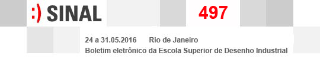
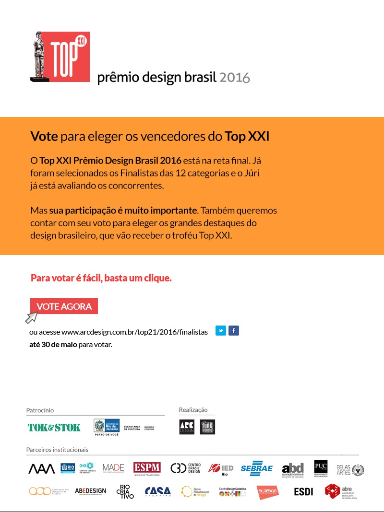
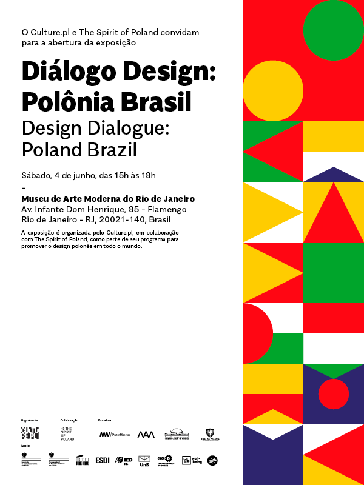
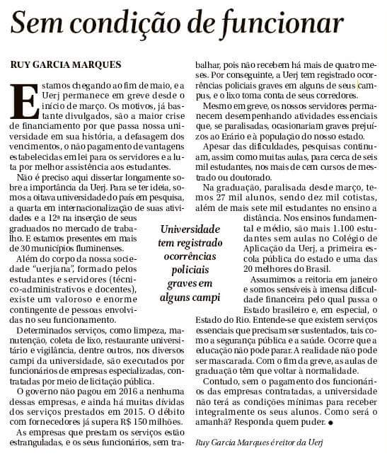

<!--
---
title: sinal 497 - Esdi
-->

### Sumário

  * [Top XXI Prêmio Design Brasil 2016](#top-xxi)
  * [Consulta pública ABNT - primeiro projeto de norma sobre o design](#abnt)
  * [Diálogo Design: Polônia Brasil](#polonia-brasil)
  * [The ventriloquist summerschool](#summerschool)
  * [EXPLANAÇÃO #1](#explana)
  * [UERJ sem condições de funcionar](#sem-condicoes)

### Agenda externa
- - -

#### Top XXI Prêmio Design Brasil 2016 {#top-xxi}

O Top XXI Prêmio Design Brasil 2016 é uma iniciativa da revista ARC Design e acontece este ano, pela primeira vez, no Rio de Janeiro. Com foco nos rumos e abrangência do design brasileiro, seu objetivo é reconhecer e valorizar os profissionais e empresas de nosso mercado, fortalecendo o design nacional e ampliando sua visibilidade. A premiação está na reta final, os 12 finalistas já foram escolhidos e até o dia 30 de maio o voto popular ajudará a eleger os destaques. Para votar, acesse http://www.arcdesign.com.br/top21/2016/finalistas

- - -

#### Consulta pública ABNT – primeiro projeto de norma sobre o design {#abnt}

A Comissão de Estudo Especial de Serviços de Design (ABNT/CEE-219) enviou para Consulta Nacional o primeiro projeto de norma sobre design que trata da terminologia utilizada nos serviços da área. É de extrema importância que todos os envolvidos com o mercado de serviços de design, como profissionais, professores, instituições, clientes, usuários e demais organizações, aproveitem a oportunidade de visualizar o projeto na Consulta Nacional. Todos podem optar por 3 possibilidades de voto:

**Aprovar**: significa que você não tem nenhuma observação sobre o conteúdo disposto no projeto e concorda plenamente com sua publicação da forma como o projeto está apresentado;

**Aprovar com observação de forma**: significa que você concorda com o conteúdo, porém identificou erros ortográficos que podem ser ajustados e devem ser indicados juntamente com o voto;

**Não aprovar com objeções técnicas**: significa que você tem observações de técnicas sobre o conteúdo e deve fazer sugestões tecnicamente fundamentadas de ajuste no projeto.

Essas sugestões serão avaliadas pela Comissão de Estudo, sendo que o votante será convidado a participar da reunião de análise para defender suas objeções técnicas. Para participar acesse o seguinte link abaixo, clique em visualizar (lupa) e faça um cadastro:

http://www.abntonline.com.br/consultanacional/projetos.aspx?ID=67648

- - -

#### Diálogo Design: Polônia Brasil {#polonia-brasil}

No dia 4 de Junho de 2016, das 15h às 18h, ocorrerá a abertura da exposição “Diálogo Design: Polônia Brasil”, no Museu de Arte Moderna do Rio de Janeiro. “The spirit of Poland” é uma iniciativa que visa promover a cultura, o design e o empreendedorismo do país. O projeto divulga marcas polonesas por meio de exposições em museus e centros culturais, colaboração com universidades e eventos na indústria. Para mais informações acesse: http://www.spiritofpoland.pl ou https://facebook.com/spiritofpoland

- - -

#### The ventriloquist summerschool {#summerschool}

Acontecerá entre os dias 8 e 13 de agosto de 2016 a segunda edição do “The ventriloquist summerschool” em Oslo, Noruega. Estudantes e profissionais do mundo inteiro podem se inscrever até o dia 1º de julho. Esse ano, o objetivo é desvendar o papel da ilusão como modos de ser, trabalhar e gerar conhecimento. Os participantes vão ter espaço, tempo e infraestrutura para desenvolver seus próprios projetos, além de tutores para orientação. A programação conta também com workshops públicos que proporcionam um ambiente ideal para conversas e debates. O evento é gratuito, mas os participantes precisam se inscrever para concorrer a uma das 35 vagas disponíveis. Para mais informações, acesse http://the.ventriloqui.st/summerschool/ ou entre em contato pelo email <the@ventriloqui.st>

### Agenda interna

- - -

#### EXPLANAÇÃO #1 {#explana}

No dia 28 de maio, sábado, acontecerá na Esdi a primeira edição do EXPLANAÇÃO. O evento é uma articulação para que o movimento de greve da Esdi se posicione de modo criativo, desenhando assim maneiras inventivas de se ocupar o campus da Lapa. O EXPLANAÇÃO será uma feira/festa com atividades que acontecerão das 16h às 5h. Elas têm como propósito o estímulo à reflexão sobre estes tempos onde a criatividade é combustível para resistência à gentrificação e privatização da cidade. Toda a arrecadação feita através dos bares dos eventos será revertida para a manutenção da Escola e do Centro Acadêmico – CAPO ESDI. A programação está sendo pensada junto com diversos parceiros que já confirmaram presença. É possível conferir mais em: https://www.facebook.com/events/888884454567534/

- - -

#### "UERJ sem condições de funcionar" {#sem-condicoes}

No dia 22 de maio foi publicado no jornal O Globo um artigo sobre a séria crise que a UERJ vem passando, escrito pelo atual reitor Ruy Garcia Marques. No artigo, o Reitor relata o descaso e o sucateamento que a Universidade tem sofrido, além dos problemas que estão se agravando pelo atraso dos pagamentos às empresas terceirizadas e pela falta de assistência aos estudantes. “Com o fim da greve, as aulas de graduação têm que voltar a normalidade. Contudo, sem o pagamento dos funcionários das empresas contratadas, a universidade não terá as condições mínimas para receber integralmente os seu alunos”, destaca ele.

 
- - -
O "sinal" é um informativo eletrônico produzido pelo programa de
extensão da Uerj "Esdi: Janelas Abertas" e tem como principais
objetivos divulgar atividades desenvolvidas pela Escola Superior
de Desenho Industrial e veicular notícias e informações relativas ao
ensino, ao design e a áreas correlatas.